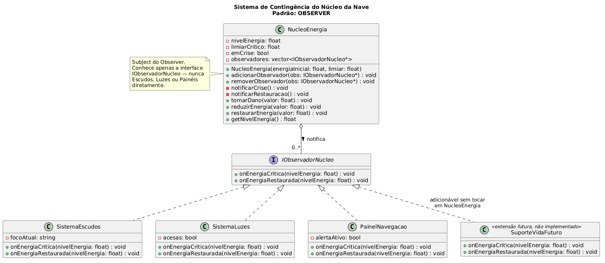
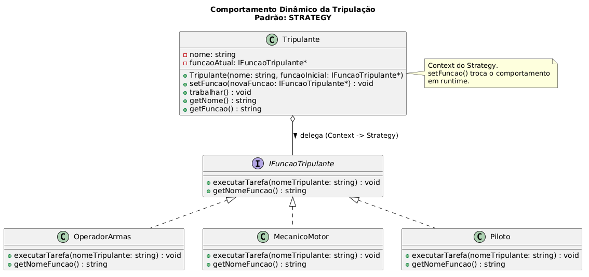
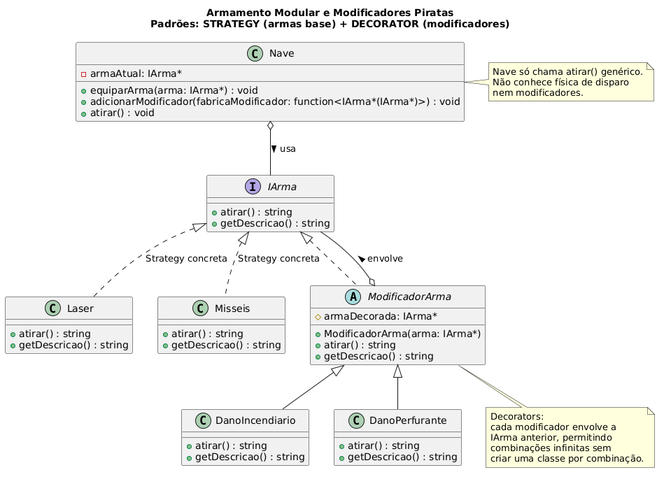

# Desafio Técnico LabTIME
MVP em C++ que implementa os três tickets do briefing de Game Design, aplicando os padrões de projeto exigidos pelas restrições arquiteturais de cada um. Todo o entregável (diagramas, código e esta documentação) está contido nesta pasta.

O código está comentado no padrão javadoc, e a documentação pode ser gerada com o Doxygen a partir do `Doxyfile` incluído no repositório (`doxygen Doxyfile`), gerando o resultado em `docs/html/index.html`.

## Mapeamento e Justificativa

### Ticket 1: Sistema de Contingência do Núcleo → **Observer**

**Requisito:** ao atingir energia crítica, escudos, luzes e painéis devem reagir automaticamente.
**Restrição:** o Núcleo não pode conhecer/referenciar essas classes, e novos reatores (ex: Suporte de Vida) devem poder ser adicionados sem tocar no Núcleo.

O Observer resolve isso diretamente: `NucleoEnergia` é o *Subject* e conhece apenas a interface `IObservadorNucleo`. Cada subsistema se inscreve via `adicionarObservador()` e é notificado por polimorfismo quando o núcleo entra ou sai de crise. Isso garante acoplamento zero entre o Núcleo e as classes concretas, e extensão por adição.



### Ticket 2: Comportamento Dinâmico da Tripulação → **Strategy**

**Requisito:** trocar a função de um NPC em runtime; a função atual dita o comportamento ao "trabalhar".
**Restrição:** proibido destruir/recriar o NPC; proibido usar if/else ou switch gigantes na classe principal.

Cada função (Operador de Armas, Mecânico, Piloto) é uma estratégia concreta que implementa `IFuncaoTripulante`. `Tripulante` é o *Context*: guarda um ponteiro para a estratégia atual e delega `trabalhar()` a ela via `funcaoAtual_->executarTarefa(...)`. Trocar de função é apenas `setFuncao()` reatribuindo o ponteiro, o mesmo objeto `Tripulante` continua o mesmo.



### Ticket 3: Armamento Modular e Modificadores Piratas → **Strategy + Decorator**

**Requisito:** trocar arma base; empilhar modificadores cumulativos sobre o tiro.
**Restrição:** a Nave só emite "atirar" genérico, sem conhecer a física de cada arma; não pode existir uma classe por combinação de atributos.

Dois padrões resolvem duas partes distintas do mesmo problema:

- **Strategy** para as armas base: `Laser` e `Misseis` implementam `IArma`, e a `Nave` (Context) só chama `armaAtual_->atirar()` sem saber qual delas está equipada.
- **Decorator** para os modificadores: `ModificadorArma` é um decorator abstrato que também implementa `IArma` e envolve outra `IArma` (`armaDecorada_`). `DanoIncendiario` e `DanoPerfurante` são decorators concretos que acrescentam efeito ao `atirar()` da arma envolvida. Como cada decorator também é uma `IArma`, eles podem ser empilhados infinitamente (`adicionar_modificador` várias vezes) sem nunca precisar de uma classe nova por combinação.



---

## Identificação dos Papéis no Código

### Ticket 1: Observer (`src/nucleo/`)

| Papel do padrão | Classe/Interface |
|---|---|
| Interface do Observer | `IObservadorNucleo` (`onEnergiaCritica`, `onEnergiaRestaurada`) |
| Subject | `NucleoEnergia` (mantém `observadores_`, chama `notificarCrise()`/`notificarRestauracao()`) |
| Observers concretos | `SistemaEscudos`, `SistemaLuzes`, `PainelNavegacao` |

### Ticket 2: Strategy (`src/tripulacao/`)

| Papel do padrão | Classe/Interface |
|---|---|
| Interface da Strategy | `IFuncaoTripulante` (`executarTarefa`, `getNomeFuncao`) |
| Strategies concretas | `OperadorArmas`, `Mecanico`, `Piloto` |
| Context | `Tripulante` (guarda `funcaoAtual_`, expõe `setFuncao()` e `trabalhar()`) |

### Ticket 3: Strategy + Decorator (`src/armamento/`)

| Papel do padrão | Classe/Interface |
|---|---|
| Interface comum (Strategy + Decorator) | `IArma` (`atirar`, `getDescricao`) |
| Strategies concretas (armas base) | `Laser`, `Misseis` |
| Decorator abstrato | `ModificadorArma` (guarda `armaDecorada_`, também é uma `IArma`) |
| Decorators concretos | `DanoIncendiario`, `DanoPerfurante` |
| Context | `Nave` (guarda `armaAtual_`, expõe `equiparArma()`, `adicionarModificador()`, `atirar()`) |

---

## Comandos do console interativo

O `main.cpp` implementa um loop de leitura de comandos digitados no console.

| Comando | Efeito |
|---|---|
| `tomar_dano <valor>` | Aplica dano de combate ao núcleo |
| `reduzir_energia <valor>` | Reduz energia do núcleo por consumo |
| `restaurar_energia <valor>` | Restaura energia do núcleo |
| `status_nucleo` | Mostra energia atual e se está em crise |
| `listar_tripulantes` | Lista tripulantes e suas funções atuais |
| `trocar_funcao <nome> <funcao>` | Troca a função de um tripulante vivo: `funcao`: `operador`\|`mecanico`\|`piloto` |
| `trabalhar <nome>` | Manda o tripulante executar a tarefa da função atual |
| `equipar_arma <tipo>` | Equipa arma base: `tipo`: `laser`\|`misseis` |
| `adicionar_modificador <tipo>` | Empilha modificador na arma atual: `tipo`: `incendiario`\|`perfurante` |
| `atirar` | Dispara a arma/modificadores atuais |
| `ajuda` | Lista os comandos |
| `sair` | Encerra o programa |

---

## Instruções de Execução

Projeto sem sistema de build (CMake/Makefile): compilação direta via g++ (C++17), sem dependências externas.

**Pré-requisito:** g++ com suporte a C++17 (ex: MinGW-w64/MSYS2 no Windows, ou `build-essential` no Linux).

### Clonar o repositório

```bash
git clone https://github.com/sfDavi/desafio-labtime-2026.git
cd desafio-labtime-2026
```

### Windows (PowerShell)

```powershell
g++ -std=c++17 -Wall -o desafiolabtime.exe (Get-ChildItem -Recurse -Filter *.cpp -Path src).FullName
.\desafiolabtime.exe
```

### Linux / macOS

```bash
g++ -std=c++17 -Wall -o desafiolabtime $(find src -name "*.cpp")
./desafiolabtime
```

Ao iniciar, o programa entra em loop lendo comandos do console. Digite `ajuda` para listar os comandos e `sair` para encerrar.